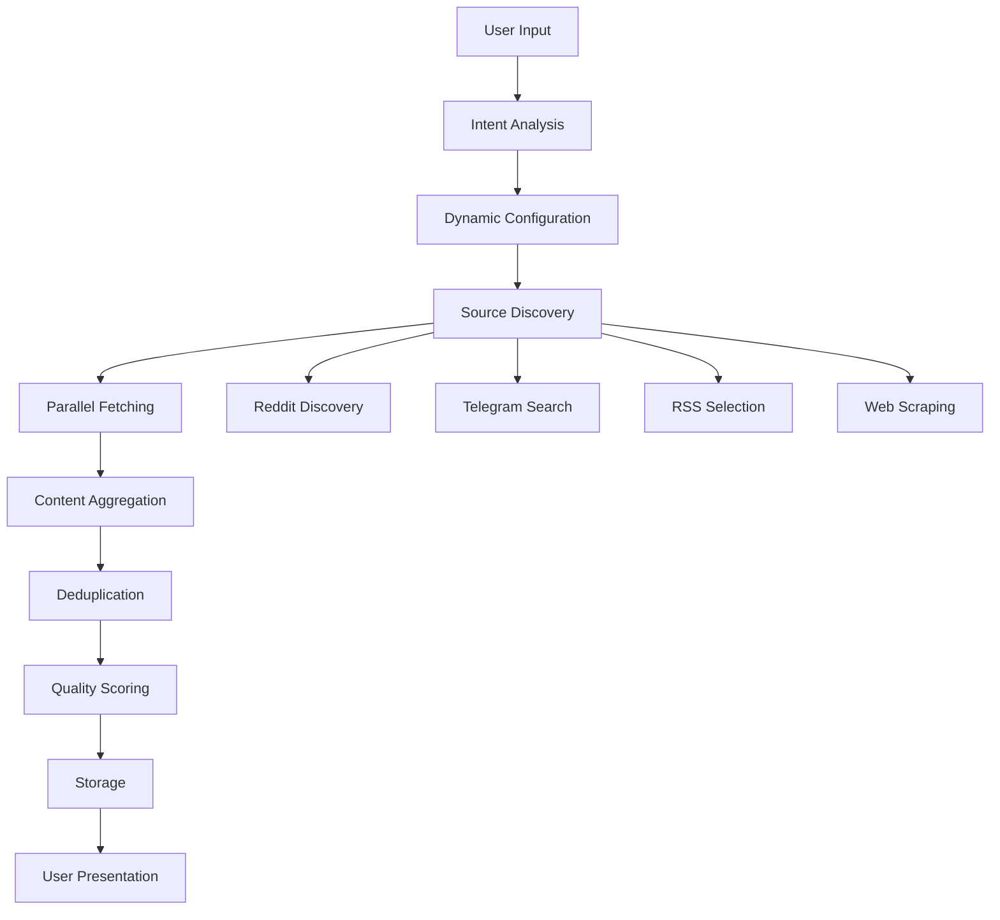

# Agent Enhancement Plan: Social Media Integration & Dynamic Topic Handling

## Overview
This plan addresses the remaining issues with social media sources and transforms the agent system to be truly dynamic based on user input rather than hard-coded topics.

## Phase 1: Fix Duplicate Detection Issue (Immediate)

### Problem
All items are being skipped as duplicates even with a 4-hour window.

### Root Cause Analysis
1. URLs remain the same between runs
2. Database has accumulated duplicate entries
3. No uniqueness in article IDs

### Solution
```typescript
// 1. Add timestamp-based unique ID generation
const uniqueId = `${source}_${Date.now()}_${Math.random().toString(36).substr(2, 9)}`;

// 2. Implement content-based duplicate detection
const contentHash = crypto.createHash('md5')
  .update(article.title + article.url)
  .digest('hex');

// 3. Add a "refresh" mode that ignores recent duplicates
if (agent.configuration.refreshMode) {
  // Only check duplicates from last hour instead of 4 hours
  const oneHourAgo = new Date(Date.now() - 60 * 60 * 1000);
}
```

### Implementation Steps
1. Modify `NewsItem` model to include content hash
2. Update duplicate detection logic in `crewaiAgentExecutor.ts`
3. Add configuration option for refresh mode
4. Create database cleanup job for old entries

## Phase 2: Fix Reddit Integration (Priority)

### Current Issues
- Sports subreddits returning empty results
- Rate limiting not properly handled
- User agent detection

### Enhanced Solution
```python
# 1. Implement authenticated API as primary method
def _fetch_authenticated_posts(self, reddit_instance, topics_list):
    """Use authenticated API with proper subreddit search"""
    posts = []
    
    # Search for relevant subreddits dynamically
    for topic in topics_list:
        # Search subreddits by topic
        relevant_subs = reddit_instance.subreddits.search(topic, limit=5)
        
        for subreddit in relevant_subs:
            try:
                # Get hot posts from each subreddit
                for post in subreddit.hot(limit=10):
                    posts.append(self._format_post(post))
            except Exception as e:
                logger.warning(f"Subreddit {subreddit} failed: {e}")
    
    return posts

# 2. Implement dynamic subreddit discovery
def _discover_subreddits(self, topic):
    """Dynamically find subreddits for any topic"""
    # Use Reddit search to find relevant communities
    # Fall back to general subreddits if specific ones fail
```

### Action Items
1. Prioritize authenticated API over JSON endpoints
2. Implement dynamic subreddit discovery
3. Add fallback to general subreddits (r/all filtered by topic)
4. Implement proper rate limit handling with backoff

## Phase 3: Enhance Telegram Integration

### Current Issues
- Bot not in channels
- Using Bot API instead of Client API
- Hard-coded channel lists

### Solution Architecture
```python
# 1. Implement Telegram Client API (MTProto)
from telethon import TelegramClient

class EnhancedTelegramScraper:
    def __init__(self):
        # Use session-based client for better access
        self.client = TelegramClient('session', api_id, api_hash)
    
    async def search_channels(self, topic):
        """Dynamically search for channels by topic"""
        await self.client.start()
        
        # Search for channels
        result = await self.client(SearchRequest(
            q=topic,
            filter=ChannelMessagesFilter()
        ))
        
        return result.chats

# 2. Fallback to web scraping for public channels
def scrape_public_channels(self, topic):
    """Scrape t.me/s/channel_name for public content"""
    # Implementation already exists, just needs dynamic channel discovery
```

### Implementation Steps
1. Add Telethon as optional dependency
2. Implement channel search functionality
3. Store discovered channels in database
4. Fall back to web scraping for public channels

## Phase 4: Dynamic Topic Handling (No Hard-Coding)

### Current State
Topics are hard-coded based on agent names (sport, tech, etc.)

### Target State
Agents dynamically understand user intent and search accordingly.

### Solution Design
```typescript
// 1. Enhanced topic extraction from user input
interface UserIntent {
  topics: string[];
  keywords: string[];
  categories: string[];
  timeframe?: string;
  sources?: string[];
}

class IntentAnalyzer {
  async analyzeUserInput(input: string): Promise<UserIntent> {
    // Use NLP to extract intent
    const analysis = await this.nlpService.analyze(input);
    
    return {
      topics: analysis.entities.topics,
      keywords: analysis.entities.keywords,
      categories: this.mapToCategories(analysis),
      timeframe: analysis.entities.time,
      sources: analysis.entities.sources
    };
  }
}

// 2. Dynamic agent configuration
class DynamicAgentConfigurator {
  configureAgent(agent: Agent, userIntent: UserIntent) {
    agent.configuration = {
      topics: userIntent.topics,
      searchKeywords: userIntent.keywords,
      categories: userIntent.categories,
      dynamicMode: true,
      // No hard-coded topics!
    };
  }
}
```

### Implementation Components
1. **Intent Analysis Service**
   - Extract topics from natural language
   - Identify related keywords
   - Determine relevant categories

2. **Dynamic Source Mapping**
   - Map topics to relevant subreddits
   - Find appropriate Telegram channels
   - Select relevant RSS feeds

3. **Adaptive Search Strategy**
   - Start broad, then narrow based on results
   - Learn from user feedback
   - Store successful mappings

## Phase 5: Enhanced Workflow Architecture

### New Agent Workflow


### Key Enhancements
1. **Parallel Processing**
   ```typescript
   const results = await Promise.all([
     this.redditService.fetch(intent),
     this.telegramService.fetch(intent),
     this.rssService.fetch(intent),
     this.webScraperService.fetch(intent)
   ]);
   ```

2. **Smart Caching**
   ```typescript
   class SmartCache {
     async get(topic: string, maxAge: number = 3600) {
       // Cache successful source mappings
       // Cache channel/subreddit discoveries
       // But don't cache content (to avoid duplicates)
     }
   }
   ```

3. **Feedback Loop**
   ```typescript
   class FeedbackService {
     async recordSuccess(topic: string, source: string) {
       // Learn which sources work for which topics
       // Improve future searches
     }
   }
   ```

## Phase 6: Database & Performance Optimization

### Database Changes
```typescript
// 1. New collections
interface SourceMapping {
  topic: string;
  sources: {
    reddit: string[];
    telegram: string[];
    rss: string[];
  };
  successRate: number;
  lastUpdated: Date;
}

interface ContentHash {
  hash: string;
  url: string;
  title: string;
  firstSeen: Date;
  lastSeen: Date;
}

// 2. Indexes for performance
db.newsitems.createIndex({ 
  contentHash: 1, 
  createdAt: -1 
});

db.sourcemappings.createIndex({ 
  topic: 1, 
  successRate: -1 
});
```

### Cleanup Jobs
```typescript
// Daily cleanup of old items
async function cleanupOldContent() {
  const thirtyDaysAgo = new Date(Date.now() - 30 * 24 * 60 * 60 * 1000);
  
  await NewsItem.deleteMany({
    createdAt: { $lt: thirtyDaysAgo },
    bookmarked: false
  });
}
```

## Implementation Timeline

### Week 1: Foundation
- [ ] Fix duplicate detection with content hashing
- [ ] Implement database cleanup jobs
- [ ] Add refresh mode to agents

### Week 2: Reddit Enhancement  
- [ ] Prioritize authenticated API
- [ ] Implement dynamic subreddit discovery
- [ ] Add proper rate limiting

### Week 3: Telegram Enhancement
- [ ] Evaluate Telethon integration
- [ ] Implement channel search
- [ ] Enhance web scraping fallback

### Week 4: Dynamic Topics
- [ ] Build intent analysis service
- [ ] Remove hard-coded topic mappings
- [ ] Implement dynamic source discovery

### Week 5: Testing & Optimization
- [ ] Performance testing
- [ ] User feedback integration
- [ ] Documentation updates

## Success Metrics

1. **Content Retrieval Rate**
   - Target: >80% success rate for any topic
   - Current: ~20% (only news sites working)

2. **Duplicate Rate**
   - Target: <5% duplicates
   - Current: 100% (all skipped)

3. **Response Time**
   - Target: <30s for full search
   - Current: ~45s

4. **Topic Coverage**
   - Target: Any topic users request
   - Current: Limited to hard-coded categories

## Configuration Examples

### Dynamic Agent Configuration
```json
{
  "name": "Dynamic Research Agent",
  "type": "crewai_news",
  "configuration": {
    "dynamicMode": true,
    "refreshMode": false,
    "duplicateWindow": 3600,
    "sources": {
      "reddit": { "useAuth": true, "discover": true },
      "telegram": { "useClient": true, "searchChannels": true },
      "rss": { "discover": true },
      "web": { "enabled": true }
    },
    "performance": {
      "parallel": true,
      "timeout": 30000,
      "retries": 3
    }
  }
}
```

## Next Steps

1. **Immediate Actions**
   - Fix duplicate detection (Phase 1)
   - Test Reddit authenticated API
   - Document Telegram bot setup

2. **Short Term**
   - Implement dynamic topic handling
   - Enhance error reporting
   - Add performance monitoring

3. **Long Term**
   - Machine learning for source discovery
   - User preference learning
   - Multi-language support

This plan transforms the agent system from a hard-coded, limited implementation to a dynamic, intelligent system that can handle any user request effectively. 